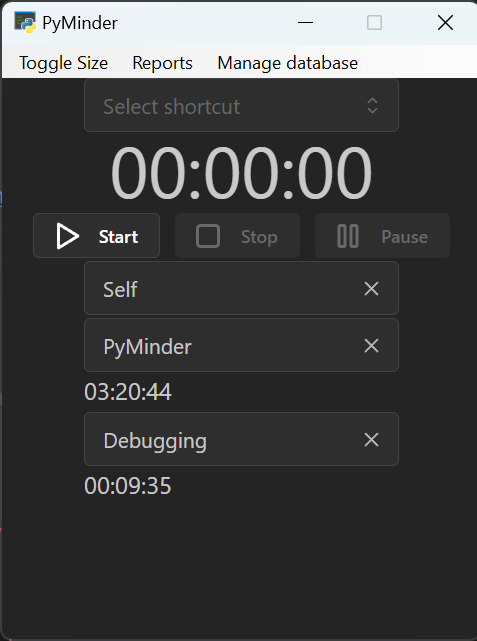

PyMinder
========

A time tracker that breaks down tracked events by Client->Project->Task.

Status: Beta/0.0.1

Works but it has some issues.

## Major components
1. Fowler's PyWebview
2. SQLAlchemy 2 w/Alembic
3. Vite Reactjs w/smc + Mantine

## Minor/mid-tier components
1. Tanstack query
2. Flask
3. Pandas

## Tooling
1. PyCharm
2. Black
3. Pylint
4. mypy
5. Eslint + Prettier
6. PyInstaller to make an exe

## Project goals

1. Make a working/usable time tracker.
2. Learn how the new SQLAlchemy 2 typed ORM works.
3. Learn how PyWebview works
4. Learn ReactJS
5. Learn how to use the ReactJS UI library MantineJS

## TODOs

1. Finish cleaning up the `Manage` pages and homogenize their layout.
2. Change the Timer/home page times for project & task to be settable as current week, month, or year.
3. Cleanup transformer.py so it is less scary
4. More unit tests!
5. Disable debug mode when not requested

## Standing issues

- Date time madness regarding timezones (local, gmt, and utc).
  - Maybe make the python/backend layer the source of "truth" for time?
- Resolve the issue with python .net library breaking poetry!
- Shortcuts partially work but should I clear the timer?
- Code consistency in the api.py file.
- Make pylint "happier"
- Wrap transformer with much more tests and then cleanup/factor before I forget how it works!
- Mantine DataTable styling isn't applying/doesn't load!

## Major components

The glue that holds it all together - 
https://pywebview.flowrl.com/

The library that abstracts working with the database - https://www.sqlalchemy.org/

The framework that makes up the frontend - https://react.dev/

The UI library that makes it prettier - https://mantine.dev/

## How to set up

1. Clone this repo
2. Initialize with poetry (https://python-poetry.org/docs/basic-usage/#initialising-a-pre-existing-project)
3. `poetry shell` and then `pip install -r requirements.txt` to install missing dependencies.
4. `python pyminder/main.py` to run.

## Basic usage

To create a new client, click the client select/combo-box, enter the client name, click "Create..." in the drop down.
To create a new project or task, repeat the steps above.

Once Client, Project, Task are set, you can press Start to begin tracking time.

## Important notes

PyMinder will create a file named `pyminder.sqlite3` which must always be in the 
CWD(current working directory) when running

When the timer is running, it saves progress every ~10 seconds to the database.

## Directories

- `pyminder/` is the application root directory
- `out/` is a work in project typing for pywebview
- `schema/` is the alembic/schema change management versions and utility file dir
- `scripts/` are one off or utility tools that should be considered dangerous
- `ui/` is the Reactjs app.
- `ui/dist` is the packaged version of the reactjs app bundled into the
- `ui/src/api.ts` is the transformed bridge code between the reactjs app and the pywebview application

